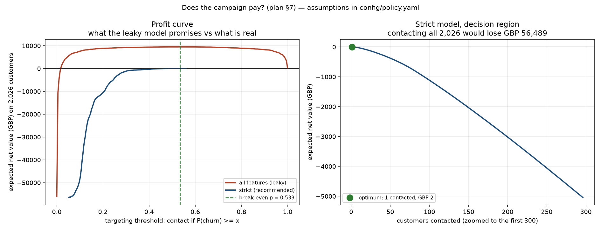

# Credit Card Churn — Model, Policy and the Decision Not to Ship

A churn model for a credit-card portfolio, built with a commercial lens: the
deliverable is a **targeting decision with a pound figure attached**, not a
leaderboard score.

The honest answer turned out to be **don't run the campaign**. This README
explains how that conclusion was reached, why it is more useful than the 0.97
PR-AUC model I could have shipped instead, and what would have to change for the
answer to flip.

---

## The recommendation

> **1. Do not run a blanket retention campaign on this model.** At the
> pre-registered assumptions it targets **1 customer** for **£2** of expected
> value. That is not a campaign.
>
> **2. Do not believe the 0.97 PR-AUC model.** It is reading the answer. Acting
> on it would have committed a **£47,000/year** business case to a number that
> does not survive production.
>
> **3. Fix the offer economics before touching the model.** The campaign needs a
> **43% save rate** to break even at a £40 offer. Cut the offer to £15 and the
> bar falls to **16%**, which is achievable.
>
> **4. Then run the experiment in [Stage 7](#stage-7--proving-it-would-work),
> because the one number the whole case depends on — the save rate — cannot be
> measured from this data at all.**

---

## Key numbers

All from the held-out test set (2,026 customers, 325 churners), scored **once**.
Every figure here is checked against the pipeline's JSON output by
`verify_report.py`.

### Model performance

| Model | Features | PR-AUC (95% CI) | ROC-AUC | Brier | lift@100 |
|---|---|---|---|---|---|
| Random baseline | – | 0.1604 | 0.5000 | – | 1.00 |
| Heuristic: fewest products | 1 | 0.2176 [0.1908, 0.2453] | 0.6235 | 0.2713 | 1.56 |
| Logistic, strict | 18 | 0.2370 [0.2042, 0.2774] | 0.6203 | 0.1314 | 1.81 |
| **LightGBM, strict** ← recommended | **18** | **0.2844 [0.2445, 0.3345]** | **0.6675** | **0.1278** | **2.43** |
| Logistic, all features | 32 | 0.7796 [0.7340, 0.8224] | 0.9360 | 0.0644 | 5.49 |
| LightGBM, all features | 32 | 0.9724 [0.9601, 0.9825] | 0.9933 | 0.0202 | 6.23 |

### The commercial layer

| | |
|---|---|
| Break-even churn probability | **53.3%** |
| Model's maximum score | 56.1% |
| Customers clearing the bar | **1** |
| Expected net value | **£2** |
| Target-everyone policy | **−£56,489** |
| What the leaky model would have promised | **£47,472/year** |

---

## The three findings that matter

### 1. The 0.97 model is reading the answer

Dropping the 14 leakage-suspect features costs **0.7288 PR-AUC** (0.9702 → 0.2414),
and the all-features model wins in **100% of 25 paired CV folds**.

That gap is not evidence the features are safe. **A large gap is exactly what
genuine predictive power looks like, and exactly what leakage looks like.** The
two are empirically indistinguishable, so performance cannot settle it — only
reasoning about how the data was generated can.

And that reasoning is damning: **the dataset has no dates.** No churn date, no
observation window. For any "last 12 months" aggregate, there is no way to show
the window closes before the churn it predicts. `months_inactive_12_mon` is the
clearest case — for a churned customer, inactivity *is* the churn.

The smoking gun: **`total_trans_amt` alone recovers 79% of the gap**, lifting
PR-AUC from 0.24 to 0.82. Real behavioural features predict churn. They do not
predict it *that* well.

Two columns were deleted before any modelling: `Naive_Bayes_Classifier_*`,
which score **ROC-AUC 1.0000** against the target with ranges that do not
overlap at all. Those are not features; they are the label wearing a different
name. See [`data/PROVENANCE.md`](data/PROVENANCE.md).

### 2. The honest model is essentially one feature

| Model | Features | PR-AUC | ROC-AUC |
|---|---|---|---|
| Random | – | 0.1607 | 0.5000 |
| Strict (all SAFE) | 18 | 0.2426 | 0.6201 |
| Strict **minus** relationship count | 16 | 0.2015 | 0.5709 |
| `total_relationship_count` **alone** | **1** | **0.2185** | 0.6124 |

One feature delivers **90%** of the strict model. The other 17 — every
demographic, tenure, income and card-tier field — add **0.0241** between them.

Worse, that load-bearing feature is the one flagged in
[`src/features.py`](src/features.py) as the weakest SAFE call *before any of this
was run*, because a customer winding down may close other products first. If so,
the strict model's modest edge is itself leakage, just subtler.

**So the headline is not "here is a churn model". It is that this dataset cannot
support a deployable churn model built only on features demonstrably known
before churn.**

That is a finding about the data, and it is what a business needs to hear before
committing budget. It is *not* an argument against behavioural features — a real
deployment would use them, computed over a window that provably closes before the
prediction date (spend in months 1–6 → churn in months 7–12). That is standard
and it works. It is impossible here only because the snapshot has no dates, which
makes the strict model **a pessimistic lower bound, not an estimate of what a
properly-built model would achieve.**

### 3. Dropping `gender` does not make the model gender-blind

Removing age and gender costs **−0.0002 PR-AUC** (interval [−0.0246, +0.0211]) —
nothing. So there is no performance case for keeping protected characteristics.

But removing them does not remove the information. **Gender is recoverable at
ROC-AUC 0.9552** from the remaining features, almost entirely through
`income_category`:

| Income band | % of women | % of men |
|---|---|---|
| Less than $40K | **60.6** | 5.4 |
| $60K–$80K | **0.0** | 28.8 |
| $80K–$120K | **0.0** | 32.3 |
| $120K+ | **0.0** | 15.9 |

Not one woman above $60K. Income band above $60K implies male with certainty.
(Almost certainly a teaching-dataset artefact — and exactly the check to run on
real data.)

**The outcome disparity no accuracy metric would have surfaced:**

| | Churn rate | Targeted (top 250) | Targeting per unit of risk |
|---|---|---|---|
| Women | 17.26% | 15.57% | 0.90 |
| Men | 14.70% | 8.80% | 0.60 |

Women churn **1.17×** as often as men but are targeted **1.77×** as often. By
age it is worse: the **55+ band has the lowest churn of any band and the highest
targeting rate**, 1.96× as hard per unit of risk as the 35–44 band.

**Recommendation:** drop age and gender (they cost nothing), keep income and
credit limit as legitimate economic predictors, and move the fairness control
from *inputs* to *outcomes*. Going genuinely gender-blind means dropping income
and credit limit too — that works (recovery falls to 0.5116) but costs
**0.0329 PR-AUC, 40% of the model's entire margin over random.**

---

## Why the campaign does not pay

```
expected value = P(churn) × P(offer saves them) × customer_value − offer_cost
```

At the assumptions committed to [`config/policy.yaml`](config/policy.yaml)
*before* anything was computed — £300 annual margin, 25% save rate, £40 offer:

```
break-even P(churn) = 40 / (0.25 × 300) = 0.533
```

The model's scores top out at 0.561. **One customer qualifies.**

### The finding is the slack, not the sign

| Assumption | Central | Break-even boundary | Slack |
|---|---|---|---|
| Customer value | £300 | £285 | **+4.9%** |
| Save rate | 25% | 23.8% | **+4.9%** |
| Offer cost | £40 | £42 | **+5.1%** |

The result sits on the break-even line in **all three directions at once**. A
business case that survives only while three independent guesses stay within ~5%
of where I set them is not a business case — it is an argument for measuring the
save rate before spending anything.

The campaign becomes materially profitable only at high customer value **and**
high save rate: at £600 / 0.35 it targets 568 customers for £8,686. So the
viable route is **segment by value first, run retention on the top tier only.**



---

## Stage 7 — proving it would work

Predicting churn is not predicting who an offer can save. The policy assumes the
highest-risk customers are the most saveable; they may be the least.

Every customer is a **sure thing**, a **lost cause**, a **persuadable**, or a
**sleeping dog** (who stays *unless* you remind them they were thinking of
leaving). A churn model cannot tell them apart — and it ranks **lost causes
highest of all**, precisely the customers an offer cannot save.

**The experiment I would actually propose:** 50/50 randomised holdout within the
top 20% by score (30.9% baseline churn), primary metric 90-day churn,
intention-to-treat, fixed horizon, analysed once.

| | At £40 offer | At £15 offer |
|---|---|---|
| Break-even save rate | **43.2%** (implausible) | **16.2%** (achievable) |
| MDE | 43.2% | 20% |
| Sample needed per arm | 161 | **826** |
| Fits the segment in one pass | yes | yes |

The £40 design needs a *smaller* sample only because it is looking for an
implausibly large effect. A small required sample is not good news here.

**Uplift modelling is step 3, not step 1.** It estimates
`P(stay | contacted) − P(stay | not)`, which is what the policy actually wants —
but it trains on the output of a randomised experiment, which does not exist
until the test above has run. The order is forced: churn model → experiment →
uplift model → uplift targeting.

---

## How it was built

```
ANALYSIS_PLAN.md      Pre-registered. Committed before any modelling.
                      §10 logs every deviation with its reason.
config/policy.yaml    Business assumptions, with reasoning. Set before computing.
data/PROVENANCE.md    Source, licence (CC0), SHA-256, two-mirror verification.
dbt/                  Staging → features in SQL. 44 dbt tests.
src/                  config · data · features · train · evaluate · policy · experiment
scripts/              Stages 3–7, each writing .txt and .json to outputs/
tests/                67 pytest cases
outputs/              tables/ (txt + json) and figures/ (png)
```

### Reproduce

```bash
python -m venv .venv && .venv/Scripts/pip install -r requirements.txt
python run_all.py          # 5-17 min depending on machine load
python -m pytest           # 67 tests
python verify_report.py    # checks every number in this README
```

Seeded throughout (`RANDOM_SEED = 20260911` in `src/config.py`). Verified
deterministic: deleting `data/churn.duckdb` and re-running the whole pipeline
leaves `git status` clean — every table, JSON and figure reproduces
byte-identically.

### The discipline, enforced mechanically rather than promised

- **The plan was committed before any modelling code existed.** `git log` shows
  the order decisions were made in.
- **The leaked columns are dropped by an explicit `select` list in SQL**, so they
  cannot reach the feature layer by oversight — plus an assertion in
  `load_features()` that raises if one ever reappears.
- **The test set was scored exactly once**, in a single block at the end of
  Stage 4. Stage 5's fairness variants are compared by cross-validation
  specifically to avoid a second pass.
- **Every number in this README is checked** against the pipeline's JSON by
  `verify_report.py`. It has caught stale figures twice.

### Things I got wrong, and left in the history

- My calibration rule chose isotonic everywhere. Isotonic collapsed **2,019
  scores into 15 distinct values** to buy 0.0015 Brier — which would have made
  "target the top 250" undefined. Rule rewritten. *(I had seen test metrics
  before changing it; that ordering is disclosed in the plan's §10 rather than
  tidied away.)*
- My fairness section asserted that removing gender "genuinely works". The proxy
  check I then wrote proved it false at ROC-AUC 0.9552. The claim is now computed.
- My Stage 7 MDE was clamped to 30% against a break-even of 43.2% — powering a
  test for an effect smaller than the campaign needs. The clamp is gone.
- Two charts implied things that were not true: a heatmap captioned "red loses"
  where no cell could be negative, and a profit curve whose scale hid the entire
  decision region.

---

## Limitations

- **No dates.** The single largest constraint. It forces a random rather than
  out-of-time split, makes the leakage question unresolvable from the data, and
  rules out CUPED, survival analysis and seasonality.
- **No revenue.** Customer value and save rate are assumptions, not measurements.
  The sensitivity analysis exists because of this.
- **No offer-response data.** P(churn) ≠ P(responds to offer), and nothing here
  can test the difference.
- **~325 test positives.** A PR-AUC difference below roughly 0.05 is inside the
  noise, which is why model selection uses repeated CV and the test set is used
  only to report.
- **A teaching dataset.** The zero-women-above-$60K pattern is not a real
  portfolio. Conclusions about *method* transfer; conclusions about *credit-card
  customers* do not.

---

*Data: Credit Card customers (Sakshi Goyal, Kaggle), CC0 Public Domain, 10,127
customers, 16.07% churn. Verified byte-identical across two independent mirrors —
see [`data/PROVENANCE.md`](data/PROVENANCE.md).*
