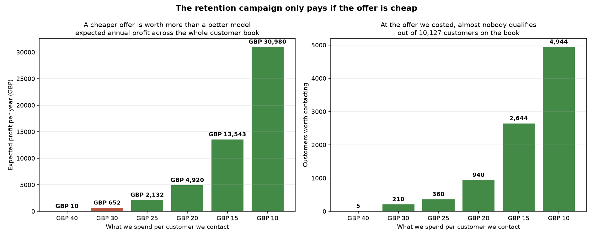

# Should we run a retention campaign on at-risk card customers?

**For: Head of Growth — one page, one chart, one recommendation.**

---

## The recommendation

**Don't launch the campaign as scoped. Make the offer cheaper, then test it on a
small group before spending anything wider.**

At the £40 offer we costed, the campaign is worth about **£10 a year**. At a £15
offer, the same customers and the same model are worth about **£13,500 a year**.

The offer price matters far more than the model does.

---

## The chart

| If we spend this per customer | Customers worth contacting | Expected profit per year |
|---|---|---|
| £40 | 5 | £10 |
| £30 | 210 | £652 |
| £25 | 360 | £2,132 |
| £20 | 940 | £4,920 |
| **£15** | **2,644** | **£13,543** |
| £10 | 4,944 | £30,980 |

---

## Why

We can rank customers by how likely they are to leave. That ranking works — the
top 100 customers contain about 2.4 times as many leavers as a random 100 would.

But ranking is only half the question. The other half is whether contacting
someone is worth what it costs.

A customer is worth contacting when:

> **(how likely they are to leave) × (how often the offer works) × (what they're
> worth to us) is more than what the offer costs.**

At a £40 offer and £300 of annual margin, that maths only works for customers
who are **more than 53% likely to leave**. Almost nobody is that certain to go —
our most at-risk customer sits at 56%. So the campaign runs out of people before
it starts.

Drop the offer to £15 and the bar falls to around 20%. Thousands of customers
clear it.

---

## What we don't know, and it's the important bit

Everything above depends on one number nobody has measured: **how often a
retention offer actually changes someone's mind.** We assumed one in four. That
was a guess.

It matters more than anything else here. If the true figure is one in eight, the
campaign loses money at every offer price we considered.

**We can't learn this from historical data**, because we've never run the offer.
The only way to find out is to try it on a small group and hold back a
comparable group who get nothing.

---

## What I'd do next

1. **Reprice the offer.** Marketing can tell us what a £15 incentive looks like
   versus £40. This is the single biggest lever and costs nothing to explore.

2. **Run a small test.** Take the 2,000 highest-risk customers, give half the
   offer and half nothing, and compare who's still with us after 90 days. That
   tells us the one number we're currently guessing.

3. **Check the value assumption.** We assumed £300 of annual margin per
   customer. Finance will have the real figure, and if it's £600 the picture
   changes completely.

4. **Don't commit budget until step 2 reports.**

---

## Two things worth knowing

**A more accurate-looking model exists, and we should not use it.** An earlier
version scored far higher and would have projected around **£47,000 a year**.
It achieved that by using information that wouldn't be available at the moment
we'd need to make the decision — in effect, it was being told the answer. That
£47,000 was never real.

**The model currently targets women and older customers harder than their actual
risk justifies.** Women leave about 1.2 times as often as men but would be
contacted 1.8 times as often. Customers over 55 have the *lowest* leaving rate of
any age group and would be contacted the *most*. This is fixable, but it should
be fixed before anything goes out, and monitored afterwards.

---

*Full analysis, assumptions and code: [`README.md`](../README.md). Every figure
above is generated by the pipeline and checked automatically — nothing here was
typed in by hand.*
